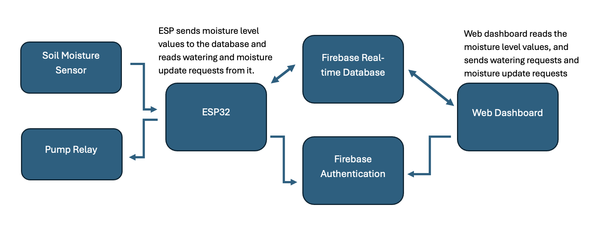

# Plant Watering Project

An IoT plant monitoring and irrigation system using an ESP32, Firebase Realtime Database, and a browser dashboard for remote control and live sensor monitoring.

## Repo layout

- `web_app/` - frontend dashboard (HTML/CSS/JS) with Firebase Realtime Database and Auth
- `firmware/` - ESP32 code and secret constants
- `assets/` - image content used by UI

## Features

- Live soil moisture readings synced to Firebase
- Manual watering trigger from authenticated dashboard
- Automatic watering below threshold moisture level
- Timestamp logging for watering and sensor updates
- Demo mode for unauthenticated visitors

## Tech stack

- Frontend: Vanilla HTML/CSS/JavaScript (`web_app/`)
- Firebase: Realtime Database + Auth
- Firmware: `Firebase_ESP_Client` for ESP + Wi-Fi + RTDB interaction

## Setup: Firebase

1. Create Firebase project.
2. Enable Realtime Database (native mode) and set rules.
   - Quick test rule:
     ```json
     {
       "rules": {
         ".read": true,
         ".write": "auth != null"
       }
     }
     ```
3. Enable Authentication -> Email/Password.
4. Add your analytics config to `web_app/firebase.js`
5. Add an authorized user in Firebase Auth.
6. Add another authorized user that will be used for the ESP.

## Setup: Firmware

1. Copy `firmware/secrets.h.example` 
2. Fill in:
   - `WIFI_SSID`, `WIFI_PASSWORD`
   - `API_KEY` (if needed for REST/auth operations)
   - `DATABASE_URL`
   - `WIFI_SSID`, `WIFI_PASSWORD`
3. Compile and flash `firmware/esp_code.ino` to ESP32/ESP8266.

## Usage

1. Open `web_app/index.html` in browser (or host via local server).
2. Sign in using the email/password account.
3. Control watering and request moisture updates.
4. Sign out to switch into demo mode.

## Block Diagram



## What I learned

- Firebase auth and RTDB integration with vanilla JS
- ESP-Firebase connectivity and auth with `esp_code` 
- Importance of securing secrets (`secrets.h` in `.gitignore`) and defining  database rules.
- Basic UI state management and feedback flow with plain JavaScript.

## Demo video

Watch the full demo on YouTube:

- [Plant Watering Demo Video](https://youtu.be/cg9LvNNaJa8)

